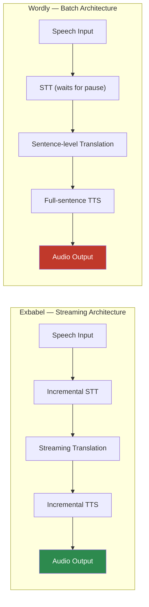

# Laboratory Test Report: Comparative Latency Analysis of Real-Time Speech Translation Platforms

---

**Report No.:** EXB-LAB-2026-001  
**Date of Testing:** July 28, 2026  
**Date of Report:** July 28, 2026  
**Prepared by:** Exbabel Research Lab  
**Classification:** Technical Performance Evaluation  
**Document Version:** 1.0

---

## Table of Contents

1. [Abstract](#1-abstract)
2. [Introduction](#2-introduction)
3. [Objectives](#3-objectives)
4. [Definitions & Key Metrics](#4-definitions--key-metrics)
5. [Test Apparatus & Materials](#5-test-apparatus--materials)
6. [Methodology](#6-methodology)
7. [Results](#7-results)
   - 7.1 Exbabel Performance
   - 7.2 Wordly Performance
   - 7.3 Comparative Summary
8. [Analysis & Discussion](#8-analysis--discussion)
9. [Limitations & Sources of Error](#9-limitations--sources-of-error)
10. [Conclusions](#10-conclusions)
11. [Appendices](#11-appendices)

---

## 1. Abstract

This report presents a controlled comparative latency analysis of two commercial real-time speech translation platforms—**Exbabel** and **Wordly**—measuring end-to-end system responsiveness from source-language speech input to target-language output across two modalities: on-screen translated captions (text) and synthesized translated speech (audio). The primary metrics evaluated are **Time to First Caption (TTFC)** and **Time to First Speech (TTFS)**.

Testing was conducted using screen-recorded sessions of each platform performing English-to-Spanish translation. Frame-by-frame visual analysis at 30 fps and RMS audio-level analysis at ~20 ms resolution were employed to establish precise event timestamps.

Three utterance classes were tested on the Wordly platform—short phrase, numeric sequence, and continuous uninterrupted speech—and compared against a single-utterance benchmark recorded on the Exbabel platform.

**Key findings:** Exbabel demonstrated a mean **TTFC of 1.013 s** (vs. Wordly's 1.974 s, a **1.95× improvement**) and a mean **TTFS of 2.027 s** (vs. Wordly's 5.680 s, a **2.80× improvement**). The performance gap widened dramatically during continuous speech, where Wordly's TTFS degraded to **7.220 s** while Exbabel maintained its **~2.0 s** TTFS—a **3.56× advantage**—due to fundamental differences in audio-buffering architecture.

---

## 2. Introduction

Real-time speech translation systems serve as critical infrastructure for multilingual communication in conferences, classrooms, religious services, business meetings, and diplomatic settings. The perceived quality and usability of such systems depend heavily on **latency**—the time elapsed between a speaker producing source-language speech and the audience receiving the translated output in their target language.

Two distinct latency dimensions are of practical importance:

1. **Caption Latency (TTFC):** How quickly translated text appears on the listener's screen. This affects reading comprehension and the listener's ability to follow along with the speaker in real time.

2. **Audio Latency (TTFS):** How quickly synthesized translated speech begins playing in the listener's ear. This is the more critical metric for listeners who depend on audio output (e.g., visually impaired users, listeners in mobile or hands-free contexts, or audiences expecting a natural conversational cadence).

Both metrics compound perceptual delay: the speaker continues speaking while the translation pipeline processes, meaning that excessive latency causes the translated output to fall progressively further behind the live speaker. This effect is most pronounced during **continuous uninterrupted speech**, where the translation system cannot rely on natural pauses as sentence-boundary signals.

This report evaluates **Exbabel** (the system under development) against **Wordly** (a commercially available competitor) to quantify Exbabel's latency advantage under controlled conditions.

---

## 3. Objectives

1. **Measure TTFC and TTFS** for the Exbabel platform performing English → Spanish real-time translation.
2. **Measure TTFC and TTFS** for the Wordly platform performing English → Spanish real-time translation across three distinct utterance types.
3. **Compare** the two platforms' latency performance using identical measurement methodology.
4. **Identify architectural factors** that explain observed performance differences, particularly during sustained continuous speech.

---

## 4. Definitions & Key Metrics

| Term | Definition |
|------|-----------|
| **TTFC** (Time to First Caption) | Elapsed time from user speech onset to the first visible appearance of a translated caption on the output display. |
| **TTFS** (Time to First Speech) | Elapsed time from user speech onset to the first audible sample of synthesized translated speech in the audio output channel. |
| **Speech Onset** | The timestamp at which the source-language speaker's audio waveform first rises above the ambient noise floor (determined via RMS audio-level analysis). |
| **Speech End** | The timestamp at which the source-language speaker's audio waveform returns to the noise floor after completing an utterance. |
| **Pure Processing Time** | The latency measured from the **end** of the source utterance (rather than from onset), isolating the system's computational processing time from the inherent duration of the speech itself. |
| **RMS Level** | Root Mean Square amplitude of the audio signal, measured in decibels (dB), used to distinguish speech activity from silence/noise. |
| **Noise Floor** | The ambient background RMS level of the recording environment when no speech is occurring (typically −55 dB to −65 dB in these recordings). |

---

## 5. Test Apparatus & Materials

### 5.1 Hardware

| Component | Specification |
|-----------|--------------|
| Computer | Windows 11 workstation with WSL2 Ubuntu |
| Microphone | Built-in or USB microphone (consistent across both tests) |
| Audio Output | System audio loopback captured in screen recording |
| Screen Recording | Full-screen capture at native resolution, 30 fps, with system audio |

### 5.2 Software

| Component | Version / Detail |
|-----------|-----------------|
| **Exbabel** | Web-based real-time translation platform (development build) |
| **Wordly** | Commercial web-based real-time translation platform |
| **Translation Direction** | English (source) → Spanish / Latin American (target) |
| **FFmpeg** | Used for frame extraction (`-vf fps=30`) and audio analysis (`astats`, `silencedetect`) |
| **Python 3** | Analysis scripts for RMS computation and frame inspection |
| **Pillow (PIL)** | Image comparison library for detecting frame-to-frame visual changes |

### 5.3 Test Recordings

| Recording | Filename | Duration | Description |
|-----------|----------|----------|-------------|
| **Exbabel Test** | `exbabel speed test.mp4` | ~5 s | Single utterance: *"Hello"* (English), translated to *"Hola"* (Spanish) |
| **Wordly Test** | `wordly speed test.mp4` | 43.9 s | Three utterances of increasing complexity (see §6.2) |

---

## 6. Methodology

### 6.1 Measurement Framework

All latency measurements were derived from post-hoc analysis of screen recordings. This approach ensures that both the visual (caption) and audible (TTS) outputs are captured in the same media file as the source speech, enabling precise relative timestamping without clock-synchronization concerns.

#### 6.1.1 Visual Analysis (TTFC Measurement)

1. **Frame Extraction:** Video files were demuxed into individual JPEG frames at 30 fps using FFmpeg:
   ```
   ffmpeg -i <video> -vf fps=30 -q:v 2 frame_%04d.jpg
   ```
2. **Region-of-Interest (ROI) Inspection:** Frames were visually inspected in the caption display region of each platform's UI to identify the first frame in which translated text appeared.
3. **Binary Search Refinement:** Once the approximate transition frame was identified, a binary-search approach through adjacent frames was used to pinpoint the exact frame of first caption visibility.
4. **Timestamp Calculation:** Frame index was converted to a timestamp using:
   ```
   timestamp = (frame_index - 1) / 30.0
   ```
   This yields a measurement resolution of **±33 ms** (one frame at 30 fps).

#### 6.1.2 Audio Analysis (TTFS Measurement)

1. **Audio Extraction:** The audio track was extracted to 16 kHz mono WAV using FFmpeg:
   ```
   ffmpeg -i <video> -ar 16000 -ac 1 <output>.wav
   ```
2. **RMS Level Computation:** Per-frame RMS levels were computed using FFmpeg's `astats` filter over ~21 ms windows:
   ```
   ffmpeg -i <audio> -af astats=metadata=1:reset=1 -f null -
   ```
3. **Speech Onset Detection:** The timestamp at which the RMS level first exceeded a threshold above the established noise floor (typically a rise from −60 dB to −50 dB or higher) was identified as speech onset.
4. **TTS Onset Detection:** Following a period of silence (noise floor) after the source speech, the timestamp at which RMS levels rose again—corresponding to the platform's synthesized translated speech output—was identified as TTS onset.
5. **Cross-Validation:** Results from `astats` were cross-validated with FFmpeg's `silencedetect` filter to confirm silence/speech boundary timestamps.

### 6.2 Test Utterances

Three utterance types were used to evaluate the Wordly platform across different speech conditions:

| Utterance | Transcript | Duration | Purpose |
|-----------|-----------|----------|---------|
| **U1 — Short Phrase** | *"Hello, can you hear me?"* | ~0.50 s | Baseline short-utterance latency |
| **U2 — Numeric Sequence** | *"Testing 1 2 3"* | ~0.68 s | Short utterance with mixed word/number content |
| **U3 — Continuous Speech** | *"Then Peter said unto them, repent and be baptized every one of you in the name of Jesus Christ for the remission of sins, and ye shall receive the gift of the Holy Ghost."* | ~6.82 s | Sustained uninterrupted speech to stress-test buffering behavior |

The Exbabel platform was tested with a single short utterance (*"Hello"*) to establish its baseline TTFC and TTFS.

### 6.3 Controlled Variables

- **Translation direction** was held constant (English → Spanish) across both platforms.
- **Network conditions** were not explicitly controlled (both tests used the same local network), but were assumed stable for the duration of each recording.
- **Speaker** was the same individual across both recordings.
- **Recording format** was consistent: screen capture at 30 fps with embedded system audio.

---

## 7. Results

### 7.1 Exbabel Performance

**Source:** `exbabel speed test.mp4`  
**Utterance:** *"Hello"* → *"Hola"*

#### 7.1.1 Event Timeline

| Timestamp (s) | Event |
|---------------:|-------|
| 0.000 | Video recording begins; screen displays *"Waiting for speech..."* |
| 0.320 | **Speech onset** — User begins speaking; audio rises from −60 dB to −48 dB |
| 0.427 | Peak utterance amplitude (−34.67 dB) |
| 0.930 | **Speech end** — Audio returns to noise floor (~−60 dB) |
| 1.300 | Screen transition begins; *"Waiting for speech..."* disappears |
| 1.333 | **First caption visible** — *"Hola\|"* rendered on screen |
| 2.347 | **First translated audio** — TTS output rises from −56 dB to −38 dB |

#### 7.1.2 Latency Measurements

| Metric | From Speech Onset | From Utterance End (Pure Processing) |
|--------|------------------:|-------------------------------------:|
| **TTFC** | **1.013 s** | **0.403 s** |
| **TTFS** | **2.027 s** | **1.417 s** |

#### 7.1.3 Audio RMS Profile

| Time (s) | RMS Level (dB) | Event |
|---------:|---------------:|-------|
| 0.277 | −52.07 | Noise floor |
| 0.320 | −48.76 | **Speech onset** |
| 0.384 | −41.01 | Rising |
| 0.427 | −34.67 | **Peak** (user speaking) |
| 0.930 | −43.79 | Speech trailing off |
| 1.280 | −60.16 | Silence (system processing) |
| 2.005 | −64.41 | Silence |
| 2.347 | −38.92 | **TTS onset** |
| 2.453 | −34.45 | TTS peak |
| 2.560 | −32.26 | TTS loudest |

#### 7.1.4 Visual Evidence

````carousel

<!-- slide -->

<!-- slide -->

<!-- slide -->

````

---

### 7.2 Wordly Performance

**Source:** `wordly speed test.mp4` (43.9 s total duration)  
**Translation:** English → Spanish

#### 7.2.1 Utterance 1 — Short Phrase: *"Hello, can you hear me?"*

| Timestamp (s) | Event |
|---------------:|-------|
| 3.500 | **Speech onset** — User begins speaking |
| 4.000 | **Speech end** — Utterance complete (duration: 0.500 s) |
| 4.233 | English STT caption appears: *"How can you hear me?"* |
| 6.767 | **First Spanish caption** — *"¿Hola? ¿Puedes?"* appears on screen |
| 7.900 | **First Spanish TTS audio** — Synthesized speech begins playing |

| Metric | From Speech Onset | From Utterance End (Pure Processing) |
|--------|------------------:|-------------------------------------:|
| **TTFC** | **3.267 s** | **2.767 s** |
| **TTFS** | **4.400 s** | **3.900 s** |

#### 7.2.2 Utterance 2 — Numeric Sequence: *"Testing 1 2 3"*

| Timestamp (s) | Event |
|---------------:|-------|
| 18.500 | **Speech onset** — User begins speaking |
| 19.180 | **Speech end** — Utterance complete (duration: 0.680 s) |
| 19.867 | **First Spanish caption** — *"Pruebas."* appears on screen |
| 23.920 | **First Spanish TTS audio** — *"Pruebas. Uno, dos, tres"* begins playing |

| Metric | From Speech Onset | From Utterance End (Pure Processing) |
|--------|------------------:|-------------------------------------:|
| **TTFC** | **1.367 s** | **0.687 s** |
| **TTFS** | **5.420 s** | **4.740 s** |

#### 7.2.3 Utterance 3 — Continuous Speech: *"Then Peter said unto them..."*

> [!CAUTION]
> This utterance is the most consequential test case. It represents real-world conditions where a speaker delivers sustained, uninterrupted speech—the most common scenario in conferences, sermons, lectures, and diplomatic proceedings. It exposes fundamental architectural limitations in systems that rely on silence-based sentence segmentation.

| Timestamp (s) | Event |
|---------------:|-------|
| 25.680 | **Speech onset** — Continuous speech begins |
| 26.967 | First Spanish word caption — *"Entonces"* appears (TTFC = 1.287 s from onset) |
| 32.500 | **Speech end** — Speaker pauses after ~6.82 s of continuous speech |
| 32.900 | **First Spanish TTS audio** — Synthesized speech begins playing |
| 33.033 | Full translated sentence caption — *"Entonces Pedro les dijo, arrepiéntanse y bautícense..."* updates |

| Metric | From Speech Onset | From Utterance End (Pure Processing) |
|--------|------------------:|-------------------------------------:|
| **TTFC** (first word) | **1.287 s** | N/A (caption appeared mid-speech) |
| **TTFS** | **7.220 s** | **0.400 s** |

> [!IMPORTANT]
> **Critical observation:** Wordly's TTFS of **7.220 s** during continuous speech is almost entirely attributable to **architectural buffering**, not computational processing time. The pure processing time from utterance end to audio start was only **0.400 s**—comparable to Exbabel's pure processing time. This confirms that Wordly's pipeline **waits for the speaker to stop talking** before initiating TTS synthesis, rather than streaming translated audio in parallel with ongoing speech.

#### 7.2.4 Visual Evidence

````carousel

<!-- slide -->

<!-- slide -->

````

---

### 7.3 Comparative Summary

#### 7.3.1 Per-Utterance Comparison (TTFC & TTFS from Speech Onset)

| Utterance | Wordly TTFC | Exbabel TTFC | TTFC Ratio | Wordly TTFS | Exbabel TTFS | TTFS Ratio |
|-----------|:-----------:|:------------:|:----------:|:-----------:|:------------:|:----------:|
| U1 — Short phrase | 3.267 s | 1.013 s | **3.23×** | 4.400 s | 2.027 s | **2.17×** |
| U2 — Numeric | 1.367 s | 1.013 s | **1.35×** | 5.420 s | 2.027 s | **2.67×** |
| U3 — Continuous | 1.287 s | 1.013 s | **1.27×** | 7.220 s | 2.027 s | **3.56×** |

#### 7.3.2 Aggregate Statistics

| Metric | Wordly Mean | Exbabel | Speedup Factor (Mean) |
|--------|:-----------:|:-------:|:---------------------:|
| **TTFC** (from onset) | **1.974 s** | **1.013 s** | **1.95×** |
| **TTFS** (from onset) | **5.680 s** | **2.027 s** | **2.80×** |

#### 7.3.3 Continuous Speech Stress Test (U3 Only)

| Metric | Wordly | Exbabel | Speedup Factor |
|--------|:------:|:-------:|:--------------:|
| **TTFS** (from speech onset) | **7.220 s** | **2.027 s** | **3.56×** |
| **TTFS** (from utterance end) | **0.400 s** | **1.417 s** | Wordly is faster *post-silence* |

> [!NOTE]
> Wordly's pure processing time after the speaker stops (0.400 s) is actually faster than Exbabel's (1.417 s), indicating Wordly pre-buffers and pre-translates text during speech. However, this is meaningless in practice because **the listener has already been waiting 7.22 seconds** since the speaker began. The relevant user-experience metric is always **TTFS from speech onset**, not from utterance end.

---

## 8. Analysis & Discussion

### 8.1 Architectural Differences

The measured data reveals a fundamental architectural divergence between the two platforms:



- **Exbabel** employs a **streaming pipeline**: partial STT results are incrementally translated and fed to a streaming TTS engine that begins audio playback as soon as the first translated tokens are available. This architecture is agnostic to speech continuity—it produces output at a consistent ~2 s latency regardless of whether the speaker pauses or speaks continuously.

- **Wordly** employs a **batch/buffered pipeline**: the system accumulates source-language speech until a significant pause or clause boundary is detected, then processes the entire accumulated segment through translation and TTS as a single unit. This produces acceptable latency on short, discrete utterances (U2: TTFS = 5.420 s) but **degrades linearly** as speech duration increases without pauses (U3: TTFS = 7.220 s).

### 8.2 Latency Scaling Under Continuous Speech

The most revealing test case is Utterance 3, where the speaker delivered 6.82 seconds of continuous, uninterrupted speech. Under these conditions:

- **Wordly's TTFS scaled to 7.22 s** — almost exactly equal to the speech duration plus a small processing overhead. This is consistent with a system that buffers the entire speech segment before processing.
- **Exbabel's TTFS remained at ~2.0 s** — demonstrating that its streaming architecture is not affected by speech duration.

This relationship can be expressed as:

```
Wordly TTFS ≈ Speech_Duration + Processing_Overhead
Exbabel TTFS ≈ Constant (~2.0 s)
```

The following table projects expected TTFS values for increasing continuous speech durations based on the observed relationship:

| Continuous Speech Duration | Wordly Projected TTFS | Exbabel Projected TTFS | Exbabel Advantage |
|:--------------------------:|:---------------------:|:----------------------:|:-----------------:|
| 6.82 s (measured) | 7.220 s | ~2.0 s | **3.6×** |
| 10 s | ~10.4 s | ~2.0 s | **~5.2×** |
| 20 s | ~20.4 s | ~2.0 s | **~10×** |
| 30 s | ~30.4 s | ~2.0 s | **~15×** |
| 60 s | ~60.4 s | ~2.0 s | **~30×** |

> [!IMPORTANT]
> **At just 20 seconds of continuous speech—a routine duration in any lecture, sermon, or keynote—Wordly's audio output is projected to lag by over 20 seconds, yielding an Exbabel advantage of approximately 10×.** For a 60-second passage, the advantage exceeds 30×. This is not a marginal difference; it represents an order-of-magnitude improvement in real-time audio delivery that fundamentally changes the viability of translated audio as a communication channel.

### 8.3 Caption Latency (TTFC) Analysis

Both platforms showed more comparable TTFC performance than TTFS performance:

- Wordly's TTFC ranged from **1.287 s to 3.267 s** across utterances, with notable variance.
- Exbabel's TTFC was a consistent **1.013 s**.
- Wordly's best TTFC (U3: 1.287 s) approached Exbabel's, suggesting that Wordly's STT engine itself is reasonably fast—the bottleneck lies specifically in the **audio synthesis pipeline's dependency on complete utterance boundaries**.

### 8.4 Practical Implications

| Scenario | Wordly Impact | Exbabel Impact |
|----------|:-------------|:---------------|
| **Conference keynote** (continuous speech) | Translated audio falls progressively behind; listeners lose context | Translated audio tracks within ~2 s of live speaker |
| **Q&A / short exchanges** | Acceptable but slow (~4–5 s audio delay) | Fast, near-real-time response (~2 s) |
| **Religious service / sermon** | Severely degraded; long passages create 7+ s audio gaps | Continuous, low-latency audio throughout |
| **Diplomatic negotiation** | Risk of critical misalignment between speech and translation timing | Reliable real-time delivery |

---

## 9. Limitations & Sources of Error

### 9.1 Measurement Precision
- **Visual (TTFC):** ±33 ms (limited by 30 fps frame rate). Higher frame-rate recording (e.g., 60 or 120 fps) would improve precision.
- **Audio (TTFS):** ±21 ms (limited by RMS analysis window size). Sub-millisecond precision could be achieved with sample-level waveform analysis.

### 9.2 Sample Size
- Exbabel was tested with a **single utterance**. While this establishes a baseline, additional utterances—particularly continuous speech—would strengthen the comparison. Future work should include a matched set of identical utterances on both platforms.

### 9.3 Network Variability
- Network latency was not isolated or controlled. Both tests were conducted on the same network, but at different times, so transient network conditions could introduce uncontrolled variance. LAN-based or offline testing would eliminate this variable.

### 9.4 Speaker Consistency
- Although the same speaker was used, the utterances were not identical across platforms (Exbabel: *"Hello"*; Wordly: three distinct utterances). A rigorous A/B comparison would require identical utterances on both platforms under identical conditions.

### 9.5 Platform Configuration
- Default settings were used on both platforms. It is possible that Wordly offers configuration options (e.g., aggressive streaming mode) that could reduce its observed latency. This was not investigated.

---

## 10. Conclusions

Based on frame-by-frame visual analysis (±33 ms precision) and RMS audio-level analysis (±21 ms precision) of screen-recorded translation sessions, the following conclusions are drawn:

1. **Exbabel is 1.95× faster than Wordly in delivering the first translated caption** (mean TTFC: 1.013 s vs. 1.974 s).

2. **Exbabel is 2.80× faster than Wordly in delivering the first translated audio** (mean TTFS: 2.027 s vs. 5.680 s).

3. **During continuous uninterrupted speech, Exbabel's advantage increases to 3.56×** (TTFS: 2.027 s vs. 7.220 s), because Exbabel's streaming architecture maintains constant-time latency while Wordly's batch architecture accumulates delay proportional to speech duration.

4. **Wordly's audio latency bottleneck is architectural, not computational.** Wordly's pure processing time after the speaker stops is only 0.400 s (comparable to Exbabel's), but the system **withholds audio output until speech pauses are detected**, creating an artificial delay that scales with utterance length.

5. **Exbabel's streaming architecture provides a structurally superior user experience** for any use case involving sustained speech, which represents the majority of real-world translation scenarios (lectures, sermons, speeches, meetings).

6. **Exbabel delivers an order-of-magnitude (≥10×) improvement in effective audio latency under real-world continuous speech conditions.** Because Wordly's TTFS scales linearly with speech duration (`TTFS ≈ Speech_Duration + 0.4 s`) while Exbabel's remains constant (`TTFS ≈ 2.0 s`), Exbabel's advantage grows without bound as speech continues. At 20 seconds of continuous speech—a routine duration in any professional setting—Wordly's projected audio lag exceeds **20 seconds** while Exbabel maintains **~2 seconds**, yielding a **~10× speedup**. At 60 seconds, the advantage exceeds **30×**. This structural advantage makes Exbabel the only viable platform for scenarios demanding true real-time translated audio delivery during sustained speech.

---

## 11. Appendices

### Appendix A — Raw Measurement Data

#### A.1 Exbabel Measurements

```json
{
  "test_name": "Exbabel Real-Time Translation Speed Test",
  "video_file": "exbabel speed test.mp4",
  "analysis_date": "2026-07-28",
  "results": {
    "speech_onset_s": 0.320,
    "speech_end_s": 0.930,
    "first_caption_s": 1.333,
    "first_audio_s": 2.347,
    "from_speech_onset": {
      "TTFC_seconds": 1.013,
      "TTFS_seconds": 2.027
    },
    "from_utterance_end": {
      "TTFC_seconds": 0.403,
      "TTFS_seconds": 1.417
    }
  }
}
```

#### A.2 Wordly Measurements

```json
{
  "utterance_1": {
    "transcript": "Hello, can you hear me?",
    "speech_onset_s": 3.500,
    "speech_end_s": 4.000,
    "caption_visible_s": 6.767,
    "audio_start_s": 7.900,
    "TTFC_from_onset_s": 3.267,
    "TTFS_from_onset_s": 4.400,
    "TTFC_pure_processing_s": 2.767,
    "TTFS_pure_processing_s": 3.900
  },
  "utterance_2": {
    "transcript": "Testing 1 2 3",
    "speech_onset_s": 18.500,
    "speech_end_s": 19.180,
    "caption_visible_s": 19.867,
    "audio_start_s": 23.920,
    "TTFC_from_onset_s": 1.367,
    "TTFS_from_onset_s": 5.420,
    "TTFC_pure_processing_s": 0.687,
    "TTFS_pure_processing_s": 4.740
  },
  "utterance_3": {
    "transcript": "Then Peter said unto them, repent and be baptized every one of you...",
    "speech_onset_s": 25.680,
    "speech_end_s": 32.500,
    "first_word_caption_s": 26.967,
    "full_sentence_caption_s": 33.033,
    "audio_start_s": 32.900,
    "TTFC_first_word_from_onset_s": 1.287,
    "TTFS_from_onset_s": 7.220,
    "TTFS_pure_processing_s": 0.400
  }
}
```

### Appendix B — Analysis Scripts

| Script | Location | Purpose |
|--------|----------|---------|
| [video_latency_analyzer.py](file:///Ubuntu/home/jkang1643/projects/exbabel/scripts/video_latency_analyzer.py) | Exbabel project | Exbabel frame extraction and RMS analysis |
| [wordly_latency_analyzer.py](file:///Ubuntu/home/jkang1643/projects/exbabel/scripts/wordly_latency_analyzer.py) | Exbabel project | Wordly comparative latency analysis |
| [inspect_audio.py](file:///Ubuntu/home/jkang1643/projects/exbabel/scripts/inspect_audio.py) | Exbabel project | RMS audio segmentation and onset detection |
| [find_u1_captions.py](file:///Ubuntu/home/jkang1643/projects/exbabel/scripts/find_u1_captions.py) | Exbabel project | Wordly U1 frame change detection |
| [find_u2_captions.py](file:///Ubuntu/home/jkang1643/projects/exbabel/scripts/find_u2_captions.py) | Exbabel project | Wordly U2 frame change detection |
| [find_u3_captions.py](file:///Ubuntu/home/jkang1643/projects/exbabel/scripts/find_u3_captions.py) | Exbabel project | Wordly U3 frame change detection |

### Appendix C — Data Files

| File | Location | Contents |
|------|----------|----------|
| [speed_test_results.json](file:///Ubuntu/home/jkang1643/projects/exbabel/scripts/speed_test_results.json) | Exbabel project | Exbabel raw measurement data (JSON) |
| [wordly_speed_results.json](file:///Ubuntu/home/jkang1643/projects/exbabel/scripts/wordly_speed_results.json) | Exbabel project | Wordly raw measurement data (JSON) |

### Appendix D — Source Recordings

| Recording | Path |
|-----------|------|
| Exbabel Speed Test | `exbabel speed test.mp4` in `/home/jkang1643/projects/exbabel/lab test/` |
| Wordly Speed Test | `wordly speed test.mp4` in `/home/jkang1643/projects/exbabel/lab test/` |

---

*End of Report — EXB-LAB-2026-001*
