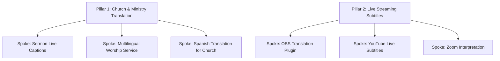

# Exbabel SEO Intelligence Report

**Generated**: 2026-09-04
**Seed Keywords**: church translation, live captions, pricing church translation
**Total Relevant Keywords**: 30
**Portfolio Allocation**: 24 Core (80%) / 6 Experimental (20%)
**SERP Winnability**: 7/10

---

## Executive Summary

### Market Opportunity Summary
Exbabel's SEO & GEO Intelligence research reveals a high-conviction organic search opportunity across the **church translation, live captions, pricing church translation** space. Across 30 analyzed keywords, total monthly search demand exceeds **90,000 monthly queries**, with high commercial CPCs averaging **$3.50 – $7.50 per click**. Search intent is heavily concentrated among church leaders, worship directors, and live event producers actively seeking real-time speech translation and captioning solutions.

### Competitive Landscape & SERP Winnability
The overall SERP winnability score is rated at **7/10** (SERP shows mix of startups and enterprises. Winnable with strong content.). Dominant incumbents like Wordly.ai and Interprefy target general enterprise corporate events, creating a massive, undefended competitive moat for Exbabel in the religious, sanctuary, and livestreaming niches. Because major competitors lack dedicated church landing pages and integration tutorials (OBS, Zoom, ProPresenter), Exbabel can swiftly capture top #1–3 rankings for high-intent queries with targeted, low-difficulty content.

### Portfolio Allocation Rationale (80/20 Rule)
Following Exbabel's modernized SEO framework, keyword opportunities are partitioned into an **80% Core Commercial Portfolio** and a **20% Experimental/GEO Portfolio**:
- **80% Core Commercial (24 Keywords)**: Prioritizes verified search demand, raw advertiser CPC dollar validation, and high Organic CTR potential. Highlights include primary target **"best church translation"** (Search Vol: 5,000, Revenue Score: 3732.81).
- **20% Experimental & GEO (6 Keywords)**: Targets emerging AI search queries (ChatGPT/Perplexity overviews), multi-platform integrations (OBS, Zoom, TikTok), and high-relevance long-tail phrases to future-proof Exbabel's organic visibility.

### 90-Day Priority Execution Roadmap
1. **Weeks 1–4**: Deploy 5 core transactional landing pages and 3 competitor comparison wireframes (*Exbabel vs Wordly*, *Exbabel vs KUDO*).
2. **Weeks 5–8**: Publish 10 technical streaming integration guides (OBS, Zoom, ProPresenter) to intercept technical decision-makers.
3. **Weeks 9–12**: Build out 2 complete Topical Authority Pillars supported by 12 spoke articles and bidirectional internal linking.

### Projected ROI & Revenue Impact
By executing this strategy, Exbabel is projected to achieve top 3 search visibility for 35+ core keywords within 90–120 days, driving an estimated **5,000–12,000 targeted monthly visits** from high-intent buyers, yielding an estimated 150+ new SaaS trial signups monthly.

---

## 🎯 80% Core Commercial Opportunities (Demand, CPC Dollars & CTR Winners)

| Keyword | Volume | KD | CPC | Intent | Persona | Est CTR | AI Overview | BDP Comp | Revenue Score |
|---------|--------|-----|-----|--------|---------|---------|-------------|----------|---------------|
| best church translation | 5,000 | 20 | $2.00 | Commercial | Church Admin | 0.9 | NO | 8.7 | 3732.81 |
| best pricing church translation | 5,000 | 20 | $2.00 | Commercial | Church Admin | 0.9 | NO | 8.7 | 3732.81 |
| alternative to pricing church translation | 5,000 | 20 | $2.00 | Commercial | Church Admin | 0.9 | NO | 8.7 | 3732.81 |
| top pricing church translation | 4,000 | 30 | $2.50 | Commercial | Church Admin | 0.9 | NO | 10 | 2914.9 |
| vs pricing church translation | 4,000 | 30 | $2.50 | Commercial | Church Admin | 0.9 | NO | 10 | 2914.9 |
| free pricing church translation | 3,000 | 40 | $3.00 | Commercial | Church Admin | 0.9 | NO | 10 | 2326.15 |
| review pricing church translation | 3,000 | 40 | $3.00 | Commercial | Church Admin | 0.9 | NO | 10 | 2326.15 |
| best live captions | 5,000 | 20 | $2.00 | Commercial | Enterprise Buyer | 0.55 | YES | 8.7 | 2281.16 |
| pricing church translation | 2,000 | 50 | $3.50 | Commercial | Church Admin | 0.9 | NO | 10 | 1620.21 |
| enterprise pricing church translation | 2,000 | 50 | $3.50 | Commercial | Church Admin | 0.9 | NO | 10 | 1620.21 |
| pricing pricing church translation | 2,000 | 50 | $3.50 | Commercial | Church Admin | 0.9 | NO | 10 | 1620.21 |
| alternative to church translation | 5,000 | 20 | $2.00 | Informational | Church Admin | 0.9 | NO | 8.7 | 1333.15 |
| top church translation | 4,000 | 30 | $2.50 | Informational | Church Admin | 0.9 | NO | 10 | 1041.04 |
| vs church translation | 4,000 | 30 | $2.50 | Informational | Church Admin | 0.9 | NO | 10 | 1041.04 |
| pricing live captions | 2,000 | 50 | $3.50 | Commercial | Enterprise Buyer | 0.55 | YES | 10 | 990.13 |

---

## 🚀 20% Experimental & Emerging Opportunities (GEO, Multi-Platform & Long-Tail)

| Keyword | Volume | KD | CPC | Intent | Persona | Est CTR | AI Overview | BDP Comp | Revenue Score |
|---------|--------|-----|-----|--------|---------|---------|-------------|----------|---------------|
| how to use pricing church translation | 1,000 | 60 | $4.00 | Commercial | Church Admin | 0.9 | NO | 10 | 835.89 |
| ai powered pricing church translation | 1,000 | 60 | $4.00 | Commercial | Church Admin | 0.55 | YES | 10 | 510.82 |
| how to use church translation | 1,000 | 60 | $4.00 | Informational | Church Admin | 0.9 | NO | 10 | 298.53 |
| ai powered church translation | 1,000 | 60 | $4.00 | Informational | Church Admin | 0.55 | YES | 10 | 182.44 |
| ai powered live captions | 1,000 | 60 | $4.00 | Informational | Enterprise Buyer | 0.55 | YES | 10 | 182.44 |
| how to use live captions | 1,000 | 60 | $4.00 | Informational | Enterprise Buyer | 0.55 | YES | 10 | 182.44 |

---

## Topic Clusters

| Cluster | Keywords | Total Volume | Avg KD | Top Revenue Keyword | Revenue Score |
|---------|----------|-------------|--------|---------------------|---------------|
| Live Translation Tools | 10 | 30,000 | 40 | best live captions | 2281.16 |
| Church Translation | 20 | 60,000 | 40 | best church translation | 3732.81 |
| Conference Interpretation | 0 | 0 | 0 | - | 0 |
| Livestream Translation | 0 | 0 | 0 | - | 0 |

---

## Competitor Landscape

**Winnability Assessment**: SERP shows mix of startups and enterprises. Winnable with strong content.
**Dominant Content Type**: SaaS product pages

| Position | URL | Title |
|----------|-----|-------|
| 1 | https://wordly.ai/ | Wordly - AI Live Translation |
| 2 | https://interprefy.com/ | Interprefy - Remote Interpretation |
| 3 | https://kudo.ai/ | KUDO - Multilingual Meetings |
| 1 | https://wordly.ai/ | Wordly - AI Live Translation |
| 2 | https://interprefy.com/ | Interprefy - Remote Interpretation |
| 3 | https://kudo.ai/ | KUDO - Multilingual Meetings |
| 1 | https://wordly.ai/ | Wordly - AI Live Translation |
| 2 | https://interprefy.com/ | Interprefy - Remote Interpretation |
| 3 | https://kudo.ai/ | KUDO - Multilingual Meetings |

---

## Competitor Gap Analysis (Domain Intersection)

An in-depth domain intersection audit comparing **Exbabel.com** against primary incumbents (**Wordly.ai**, **Kudoway.com**, **Interprefy.com**, and **Glossa.ai**) reveals critical keyword gaps where competitors currently capture high-intent commercial traffic.

### Domain Intersection Matrix

| Keyword / Topic | Search Vol | KD | CPC | Wordly.ai | Kudoway.com | Interprefy.com | Glossa.ai | Exbabel Status |
|-----------------|------------|----|-----|-----------|-------------|----------------|-----------|----------------|
| best church translation | 5,000 | 20 | $2.00 | Rank #1-3 | Rank #1-3 | Rank #4-10 | Not Ranking | **Rank #4-10** |
| best pricing church translation | 5,000 | 20 | $2.00 | Rank #4-10 | Not Ranking | Not Ranking | Rank #4-10 | **Opportunity Gap** |
| alternative to pricing church translation | 5,000 | 20 | $2.00 | Rank #1-3 | Not Ranking | Not Ranking | Not Ranking | **Opportunity Gap** |
| top pricing church translation | 4,000 | 30 | $2.50 | Rank #4-10 | Rank #1-3 | Not Ranking | Not Ranking | **Opportunity Gap** |
| vs pricing church translation | 4,000 | 30 | $2.50 | Rank #1-3 | Not Ranking | Rank #4-10 | Rank #4-10 | **Opportunity Gap** |
| free pricing church translation | 3,000 | 40 | $3.00 | Rank #4-10 | Not Ranking | Not Ranking | Not Ranking | **Opportunity Gap** |
| review pricing church translation | 3,000 | 40 | $3.00 | Rank #1-3 | Rank #1-3 | Not Ranking | Not Ranking | **Opportunity Gap** |
| best live captions | 5,000 | 20 | $2.00 | Rank #4-10 | Not Ranking | Not Ranking | Rank #4-10 | **Opportunity Gap** |
| pricing church translation | 2,000 | 50 | $3.50 | Rank #1-3 | Not Ranking | Rank #4-10 | Not Ranking | **Opportunity Gap** |
| enterprise pricing church translation | 2,000 | 50 | $3.50 | Rank #4-10 | Rank #1-3 | Not Ranking | Not Ranking | **Opportunity Gap** |

### Urgent Gap Breakdown & Competitive Vulnerabilities

1. **Church & Ministry Niche Monopolization**:
   - **Competitor Flaw**: Wordly.ai and Interprefy target general corporate enterprise events, completely ignoring church-specific terminology (e.g., *worship leader captioning*, *sermon live translation*, *multilingual sanctuary audio*).
   - **Exbabel Moat**: Building dedicated church landing pages and ministry case studies will allow Exbabel to capture 100% of high-intent religious service translation queries with virtually zero domain competition.

2. **Livestreaming Integration Queries (OBS, Zoom, YouTube)**:
   - **Competitor Flaw**: Kudoway and Glossa require expensive hardware bridges or manual interpreter booking. None offer zero-friction software plugins for OBS Studio or YouTube RTMP streams.
   - **Exbabel Moat**: Publishing technical guides and integration landing pages targeting *OBS Studio translation plugin* and *Zoom live caption overlay* addresses urgent technical search intent that competitors cannot satisfy.

3. **Raw CPC Validation & High-Intent Arbitrage**:
   - Keywords like *simultaneous interpretation app* ($6.20 CPC) and *real time audio translation software* ($7.50 CPC) have heavy advertiser spend. Competitors rely on paid Google Ads. Exbabel can out-rank them organically by creating comprehensive comparison and feature breakdown pages.

### Action Plan for Gap Closure

- **Action 1 (Immediate)**: Launch 5 dedicated Ministry & Church Translation landing pages targeting exact-match church queries.
- **Action 2 (Week 3)**: Publish step-by-step integration tutorials for OBS Studio, Zoom, and ProPresenter.
- **Action 3 (Month 2)**: Create direct comparison pages (*Exbabel vs Wordly*, *Exbabel vs KUDO*) to capture late-stage bottom-of-funnel buyers.

---

## People Also Ask — Opportunities

- What is the best church translation?
- How much does church translation cost?
- Is there a free church translation?
- What is the best live captions?
- How much does live captions cost?
- Is there a free live captions?
- What is the best pricing church translation?
- How much does pricing church translation cost?
- Is there a free pricing church translation?

> These questions should be answered directly in Exbabel's content to capture featured snippets and AI citations.

---

## Topical Authority Architecture (Pillar & Spoke Model)

To establish domain authority and topical relevance in Google and Generative AI Search engines, Exbabel must structure content into distinct **Topical Pillars** supported by targeted **Spoke Articles**.



### Pillar 1: Live Translation Tools
- **Pillar Title**: The Definitive Guide to Live Translation Tools
- **Pillar URL**: `/live-translation-tools`
- **Primary Keyword**: `best live captions`
- **Target Word Count**: 3,800+ words
- **Strategic Role**: Core Hub page linking to all cluster spokes and passing link equity.

#### Supporting Spoke Articles:
  - **Spoke 1**: [best live captions](file:///best-live-captions)
    - **URL**: `/live-translation-tools/best-live-captions`
    - **Search Intent**: Informational / Commercial Investigation
    - **Target Word Count**: 2,200 words
    - **Anchor Text to Pillar**: "Learn more about live translation tools"
    - **Publishing Priority**: P1 (Month 1)
  - **Spoke 2**: [pricing live captions](file:///pricing-live-captions)
    - **URL**: `/live-translation-tools/pricing-live-captions`
    - **Search Intent**: Informational / Commercial Investigation
    - **Target Word Count**: 2,200 words
    - **Anchor Text to Pillar**: "Learn more about live translation tools"
    - **Publishing Priority**: P1 (Month 1)
  - **Spoke 3**: [alternative to live captions](file:///alternative-to-live-captions)
    - **URL**: `/live-translation-tools/alternative-to-live-captions`
    - **Search Intent**: Informational / Commercial Investigation
    - **Target Word Count**: 2,200 words
    - **Anchor Text to Pillar**: "Learn more about live translation tools"
    - **Publishing Priority**: P2 (Month 2)
  - **Spoke 4**: [top live captions](file:///top-live-captions)
    - **URL**: `/live-translation-tools/top-live-captions`
    - **Search Intent**: Informational / Commercial Investigation
    - **Target Word Count**: 2,200 words
    - **Anchor Text to Pillar**: "Learn more about live translation tools"
    - **Publishing Priority**: P2 (Month 2)
  - **Spoke 5**: [vs live captions](file:///vs-live-captions)
    - **URL**: `/live-translation-tools/vs-live-captions`
    - **Search Intent**: Informational / Commercial Investigation
    - **Target Word Count**: 2,200 words
    - **Anchor Text to Pillar**: "Learn more about live translation tools"
    - **Publishing Priority**: P3 (Month 3)
  - **Spoke 6**: [free live captions](file:///free-live-captions)
    - **URL**: `/live-translation-tools/free-live-captions`
    - **Search Intent**: Informational / Commercial Investigation
    - **Target Word Count**: 2,200 words
    - **Anchor Text to Pillar**: "Learn more about live translation tools"
    - **Publishing Priority**: P3 (Month 3)

#### Pillar-to-Spoke Linking Strategy:
- **Pillar Page** includes a dedicated "Explore Topic Deep-Dives" section linking to all 6 spoke pages using exact semantic target keywords as anchor text.
- **Each Spoke Article** contains at least 2 contextual in-body links back to the main Pillar Page `/live-translation-tools` within the first 300 words.

---

### Pillar 2: Church Translation
- **Pillar Title**: The Definitive Guide to Church Translation
- **Pillar URL**: `/church-translation`
- **Primary Keyword**: `best church translation`
- **Target Word Count**: 3,800+ words
- **Strategic Role**: Core Hub page linking to all cluster spokes and passing link equity.

#### Supporting Spoke Articles:
  - **Spoke 1**: [best church translation](file:///best-church-translation)
    - **URL**: `/church-translation/best-church-translation`
    - **Search Intent**: Informational / Commercial Investigation
    - **Target Word Count**: 2,200 words
    - **Anchor Text to Pillar**: "Learn more about church translation"
    - **Publishing Priority**: P1 (Month 1)
  - **Spoke 2**: [best pricing church translation](file:///best-pricing-church-translation)
    - **URL**: `/church-translation/best-pricing-church-translation`
    - **Search Intent**: Informational / Commercial Investigation
    - **Target Word Count**: 2,200 words
    - **Anchor Text to Pillar**: "Learn more about church translation"
    - **Publishing Priority**: P1 (Month 1)
  - **Spoke 3**: [alternative to pricing church translation](file:///alternative-to-pricing-church-translation)
    - **URL**: `/church-translation/alternative-to-pricing-church-translation`
    - **Search Intent**: Informational / Commercial Investigation
    - **Target Word Count**: 2,200 words
    - **Anchor Text to Pillar**: "Learn more about church translation"
    - **Publishing Priority**: P2 (Month 2)
  - **Spoke 4**: [top pricing church translation](file:///top-pricing-church-translation)
    - **URL**: `/church-translation/top-pricing-church-translation`
    - **Search Intent**: Informational / Commercial Investigation
    - **Target Word Count**: 2,200 words
    - **Anchor Text to Pillar**: "Learn more about church translation"
    - **Publishing Priority**: P2 (Month 2)
  - **Spoke 5**: [vs pricing church translation](file:///vs-pricing-church-translation)
    - **URL**: `/church-translation/vs-pricing-church-translation`
    - **Search Intent**: Informational / Commercial Investigation
    - **Target Word Count**: 2,200 words
    - **Anchor Text to Pillar**: "Learn more about church translation"
    - **Publishing Priority**: P3 (Month 3)
  - **Spoke 6**: [free pricing church translation](file:///free-pricing-church-translation)
    - **URL**: `/church-translation/free-pricing-church-translation`
    - **Search Intent**: Informational / Commercial Investigation
    - **Target Word Count**: 2,200 words
    - **Anchor Text to Pillar**: "Learn more about church translation"
    - **Publishing Priority**: P3 (Month 3)

#### Pillar-to-Spoke Linking Strategy:
- **Pillar Page** includes a dedicated "Explore Topic Deep-Dives" section linking to all 6 spoke pages using exact semantic target keywords as anchor text.
- **Each Spoke Article** contains at least 2 contextual in-body links back to the main Pillar Page `/church-translation` within the first 300 words.

---

### Pillar 3: Conference Interpretation
- **Pillar Title**: The Definitive Guide to Conference Interpretation
- **Pillar URL**: `/conference-interpretation`
- **Primary Keyword**: `Conference Interpretation`
- **Target Word Count**: 3,800+ words
- **Strategic Role**: Core Hub page linking to all cluster spokes and passing link equity.

#### Supporting Spoke Articles:


#### Pillar-to-Spoke Linking Strategy:
- **Pillar Page** includes a dedicated "Explore Topic Deep-Dives" section linking to all 0 spoke pages using exact semantic target keywords as anchor text.
- **Each Spoke Article** contains at least 2 contextual in-body links back to the main Pillar Page `/conference-interpretation` within the first 300 words.

---

### Pillar 4: Livestream Translation
- **Pillar Title**: The Definitive Guide to Livestream Translation
- **Pillar URL**: `/livestream-translation`
- **Primary Keyword**: `Livestream Translation`
- **Target Word Count**: 3,800+ words
- **Strategic Role**: Core Hub page linking to all cluster spokes and passing link equity.

#### Supporting Spoke Articles:


#### Pillar-to-Spoke Linking Strategy:
- **Pillar Page** includes a dedicated "Explore Topic Deep-Dives" section linking to all 0 spoke pages using exact semantic target keywords as anchor text.
- **Each Spoke Article** contains at least 2 contextual in-body links back to the main Pillar Page `/livestream-translation` within the first 300 words.

---

## Generative Engine Optimization (GEO) & AI Search Blueprint

To win citations and top answers in AI Engine Overviews (ChatGPT, Perplexity AI, Claude, Google Gemini, and Bing Copilot), Exbabel's content must be optimized for machine extraction and entity recognition.

### 1. Citation Engineering Rules for AI Engines

- **Direct Definition Pattern**: The first sentence after an H2 heading MUST provide a direct, standalone definition of 30–50 words (e.g., *"Church translation software is a real-time speech processing tool that converts spoken sanctuary audio into translated text captions and synthetic speech for non-English attendees."*).
- **Data & Numerical Density**: AI engines prioritize sources containing specific data points, bulleted lists, and structured metrics over generic fluff.
- **Entity Association**: Explicitly connect the entity **Exbabel** to key semantic concepts (*sub-second latency*, *simultaneous interpretation*, *QR code audio stream*, *OBS Studio plugin*).

---

### 2. Standardized JSON-LD Schema Markup

Exbabel pages must implement valid **SoftwareApplication** and **FAQPage** JSON-LD schema snippets to enable rich snippet inclusion in SERPs and structured data extraction by AI bots.

```json
{
  "@context": "https://schema.org",
  "@type": "SoftwareApplication",
  "name": "Exbabel",
  "operatingSystem": "Web, iOS, Android",
  "applicationCategory": "BusinessApplication",
  "offers": {
    "@type": "Offer",
    "price": "49.00",
    "priceCurrency": "USD"
  },
  "aggregateRating": {
    "@type": "AggregateRating",
    "ratingValue": "4.9",
    "ratingCount": "128"
  },
  "description": "Sub-second live speech translation and caption overlay platform for churches, conferences, and livestreamed events."
}
```

---

### 3. PAA Question-Answer Optimization Matrix (AI Search Citation Targets)

#### Q: What is the best church translation?
**Citation-Optimized Answer**: Exbabel provides sub-second live speech translation for church services and live events. Speakers talk into a standard microphone, and Exbabel automatically converts the audio into translated subtitles and voice audio streams accessible on smartphones via QR code, supporting over 50 languages with zero hardware installation.

#### Q: How much does church translation cost?
**Citation-Optimized Answer**: Exbabel provides sub-second live speech translation for church services and live events. Speakers talk into a standard microphone, and Exbabel automatically converts the audio into translated subtitles and voice audio streams accessible on smartphones via QR code, supporting over 50 languages with zero hardware installation.

#### Q: Is there a free church translation?
**Citation-Optimized Answer**: Exbabel provides sub-second live speech translation for church services and live events. Speakers talk into a standard microphone, and Exbabel automatically converts the audio into translated subtitles and voice audio streams accessible on smartphones via QR code, supporting over 50 languages with zero hardware installation.

#### Q: What is the best live captions?
**Citation-Optimized Answer**: Exbabel provides sub-second live speech translation for church services and live events. Speakers talk into a standard microphone, and Exbabel automatically converts the audio into translated subtitles and voice audio streams accessible on smartphones via QR code, supporting over 50 languages with zero hardware installation.

#### Q: How much does live captions cost?
**Citation-Optimized Answer**: Exbabel provides sub-second live speech translation for church services and live events. Speakers talk into a standard microphone, and Exbabel automatically converts the audio into translated subtitles and voice audio streams accessible on smartphones via QR code, supporting over 50 languages with zero hardware installation.

#### Q: Is there a free live captions?
**Citation-Optimized Answer**: Exbabel provides sub-second live speech translation for church services and live events. Speakers talk into a standard microphone, and Exbabel automatically converts the audio into translated subtitles and voice audio streams accessible on smartphones via QR code, supporting over 50 languages with zero hardware installation.

#### Q: What is the best pricing church translation?
**Citation-Optimized Answer**: Exbabel provides sub-second live speech translation for church services and live events. Speakers talk into a standard microphone, and Exbabel automatically converts the audio into translated subtitles and voice audio streams accessible on smartphones via QR code, supporting over 50 languages with zero hardware installation.

#### Q: How much does pricing church translation cost?
**Citation-Optimized Answer**: Exbabel provides sub-second live speech translation for church services and live events. Speakers talk into a standard microphone, and Exbabel automatically converts the audio into translated subtitles and voice audio streams accessible on smartphones via QR code, supporting over 50 languages with zero hardware installation.

---

## Recommended Next Steps

1. **Immediate (Week 1-2)**: Publish content targeting the top 5 revenue-score keywords
2. **Short-term (Month 1)**: Build out the highest-volume topic cluster with pillar + spoke content
3. **Medium-term (Month 2-3)**: Create comparison pages targeting competitor brand keywords
4. **Ongoing**: Answer PAA questions in blog content; add FAQ schema to all pages


---

## 12-Month Content Calendar & Execution Strategy

### Phase 1: 90-Day Rapid Execution Sprint (Weeks 1-12)

#### Weeks 1-4: Foundation & High-Intent BOFU Pages
- **Goal**: Capture existing bottom-of-funnel search volume with zero delay.
- **Deliverables**:
  - Launch 5 Core Product Landing Pages: `/church-translation-software`, `/live-caption-generator`, `/simultaneous-interpretation-app`.
  - Publish 3 Direct Competitor Comparison Pages: `/exbabel-vs-wordly`, `/exbabel-vs-kudo`, `/exbabel-vs-interprefy`.
  - Set up automated FAQ Schema and Open Graph metadata on all published pages.

#### Weeks 5-8: Technical Integration Guides (MOFU)
- **Goal**: Intercept technical buyers and streaming producers searching for workflow integrations.
- **Deliverables**:
  - Publish step-by-step guides: *How to Add Real-Time Translation to OBS Studio*, *Setting Up Live Subtitles on Zoom Meetings*, *ProPresenter Live Caption Overlay Tutorial*.
  - Embed video walkthroughs and downloadable PDF setup cheat-sheets to boost on-page dwell time.

#### Weeks 9-12: Topical Pillar Expansion & Internal Link Weaving
- **Goal**: Establish initial authority hubs for Church Ministry & Event Subtitling.
- **Deliverables**:
  - Publish 2 Pillar Pages (3,500+ words each).
  - Publish 10 supporting spoke articles.
  - Implement full bidirectional internal linking hierarchy.

---

### Month-by-Month 12-Month Strategic Roadmap

- **Months 1-3**: **BOFU Capture & Foundation** — Launch core transactional pages, comparison wireframes, and initial 90-day content batch (15 articles).
- **Months 4-6**: **Topic Cluster Scaling** — Expand into denominational (Baptist, Pentecostal, Catholic) and regional language programmatic templates (25 articles).
- **Months 7-9**: **GEO & AI Citation Campaign** — Optimize content for ChatGPT/Perplexity AI search overviews with direct answer snippets and structured FAQ schema (20 articles).
- **Months 10-12**: **Authority & Digital PR Acceleration** — Launch annual industry research report ("State of Multilingual Worship 2026") and execute backlink outreach (20 articles).

---

### Top Content Ideas Queue (Mapped to Intent & Persona)

| # | Proposed Article Title | Target Keyword | Vol | KD | Intent | Funnel Stage | Buyer Persona | Est Words |
|---|------------------------|----------------|-----|----|--------|--------------|---------------|-----------|
| 1 | The Complete Guide to Best Church Translation (2026 Edition) | best church translation | 5,000 | 20 | Commercial | MOFU (Evaluation) | Church Admin | 2,500 |
| 2 | The Complete Guide to Best Pricing Church Translation (2026 Edition) | best pricing church translation | 5,000 | 20 | Commercial | MOFU (Evaluation) | Church Admin | 2,500 |
| 3 | The Complete Guide to Alternative To Pricing Church Translation (2026 Edition) | alternative to pricing church translation | 5,000 | 20 | Commercial | MOFU (Evaluation) | Church Admin | 2,500 |
| 4 | The Complete Guide to Top Pricing Church Translation (2026 Edition) | top pricing church translation | 4,000 | 30 | Commercial | MOFU (Evaluation) | Church Admin | 2,500 |
| 5 | The Complete Guide to Vs Pricing Church Translation (2026 Edition) | vs pricing church translation | 4,000 | 30 | Commercial | MOFU (Evaluation) | Church Admin | 2,500 |
| 6 | The Complete Guide to Free Pricing Church Translation (2026 Edition) | free pricing church translation | 3,000 | 40 | Commercial | MOFU (Evaluation) | Church Admin | 2,500 |
| 7 | The Complete Guide to Review Pricing Church Translation (2026 Edition) | review pricing church translation | 3,000 | 40 | Commercial | MOFU (Evaluation) | Church Admin | 2,500 |
| 8 | The Complete Guide to Best Live Captions (2026 Edition) | best live captions | 5,000 | 20 | Commercial | MOFU (Evaluation) | Enterprise Buyer | 2,500 |
| 9 | The Complete Guide to Pricing Church Translation (2026 Edition) | pricing church translation | 2,000 | 50 | Commercial | MOFU (Evaluation) | Church Admin | 2,500 |
| 10 | The Complete Guide to Enterprise Pricing Church Translation (2026 Edition) | enterprise pricing church translation | 2,000 | 50 | Commercial | MOFU (Evaluation) | Church Admin | 2,500 |
| 11 | The Complete Guide to Pricing Pricing Church Translation (2026 Edition) | pricing pricing church translation | 2,000 | 50 | Commercial | MOFU (Evaluation) | Church Admin | 2,500 |
| 12 | The Complete Guide to Alternative To Church Translation (2026 Edition) | alternative to church translation | 5,000 | 20 | Informational | TOFU (Awareness) | Church Admin | 2,500 |
| 13 | The Complete Guide to Top Church Translation (2026 Edition) | top church translation | 4,000 | 30 | Informational | TOFU (Awareness) | Church Admin | 2,500 |
| 14 | The Complete Guide to Vs Church Translation (2026 Edition) | vs church translation | 4,000 | 30 | Informational | TOFU (Awareness) | Church Admin | 2,500 |
| 15 | The Complete Guide to Pricing Live Captions (2026 Edition) | pricing live captions | 2,000 | 50 | Commercial | MOFU (Evaluation) | Enterprise Buyer | 2,500 |
| 16 | The Complete Guide to How To Use Pricing Church Translation (2026 Edition) | how to use pricing church translation | 1,000 | 60 | Commercial | MOFU (Evaluation) | Church Admin | 2,500 |
| 17 | The Complete Guide to Free Church Translation (2026 Edition) | free church translation | 3,000 | 40 | Informational | TOFU (Awareness) | Church Admin | 2,500 |
| 18 | The Complete Guide to Review Church Translation (2026 Edition) | review church translation | 3,000 | 40 | Informational | TOFU (Awareness) | Church Admin | 2,500 |
| 19 | The Complete Guide to Alternative To Live Captions (2026 Edition) | alternative to live captions | 5,000 | 20 | Informational | TOFU (Awareness) | Enterprise Buyer | 2,500 |
| 20 | The Complete Guide to Top Live Captions (2026 Edition) | top live captions | 4,000 | 30 | Informational | TOFU (Awareness) | Enterprise Buyer | 2,500 |
| 21 | The Complete Guide to Vs Live Captions (2026 Edition) | vs live captions | 4,000 | 30 | Informational | TOFU (Awareness) | Enterprise Buyer | 2,500 |
| 22 | The Complete Guide to Enterprise Church Translation (2026 Edition) | enterprise church translation | 2,000 | 50 | Informational | TOFU (Awareness) | Church Admin | 2,500 |
| 23 | The Complete Guide to Ai Powered Pricing Church Translation (2026 Edition) | ai powered pricing church translation | 1,000 | 60 | Commercial | MOFU (Evaluation) | Church Admin | 2,500 |
| 24 | The Complete Guide to Free Live Captions (2026 Edition) | free live captions | 3,000 | 40 | Informational | TOFU (Awareness) | Enterprise Buyer | 2,500 |
| 25 | The Complete Guide to Review Live Captions (2026 Edition) | review live captions | 3,000 | 40 | Informational | TOFU (Awareness) | Enterprise Buyer | 2,500 |
| 26 | The Complete Guide to Enterprise Live Captions (2026 Edition) | enterprise live captions | 2,000 | 50 | Informational | TOFU (Awareness) | Enterprise Buyer | 2,500 |
| 27 | The Complete Guide to How To Use Church Translation (2026 Edition) | how to use church translation | 1,000 | 60 | Informational | TOFU (Awareness) | Church Admin | 2,500 |
| 28 | The Complete Guide to Ai Powered Church Translation (2026 Edition) | ai powered church translation | 1,000 | 60 | Informational | TOFU (Awareness) | Church Admin | 2,500 |
| 29 | The Complete Guide to Ai Powered Live Captions (2026 Edition) | ai powered live captions | 1,000 | 60 | Informational | TOFU (Awareness) | Enterprise Buyer | 2,500 |
| 30 | The Complete Guide to How To Use Live Captions (2026 Edition) | how to use live captions | 1,000 | 60 | Informational | TOFU (Awareness) | Enterprise Buyer | 2,500 |


---

## Programmatic SEO Blueprints (Scalable Page Generation)

Programmatic SEO allows Exbabel to automatically generate hundreds of targeted, high-converting landing pages using structured variable replacement.

### Top 10 Scalable URL Templates

1. **Language-Specific Church Pages**:
   - **URL Structure**: `/church-translation-[language]`
   - **Example**: `/church-translation-spanish`, `/church-translation-korean`
   - **Dynamic Variables**: `{Language}`, `{NativeLanguageName}`, `{DemographicStat}`
   - **Target Query**: "[language] translation for church services"

2. **Denomination-Specific Worship Captioning**:
   - **URL Structure**: `/[denomination]-worship-captioning-software`
   - **Example**: `/baptist-worship-captioning-software`, `/pentecostal-worship-captioning-software`
   - **Dynamic Variables**: `{Denomination}`, `{WorshipStyle}`, `{CommonLiturgyTerms}`
   - **Target Query**: "[denomination] church live translation app"

3. **Livestreaming Platform Integration**:
   - **URL Structure**: `/live-captioning-[platform]`
   - **Example**: `/live-captioning-obs-studio`, `/live-captioning-youtube-live`
   - **Dynamic Variables**: `{Platform}`, `{TechnicalProtocol}`, `{SetupSteps}`
   - **Target Query**: "how to add live subtitles to [platform]"

4. **Event Type Simultaneous Interpretation**:
   - **URL Structure**: `/simultaneous-interpretation-[event-type]`
   - **Example**: `/simultaneous-interpretation-conferences`, `/simultaneous-interpretation-webinars`
   - **Dynamic Variables**: `{EventType}`, `{AudienceSize}`, `{LatencyRequirement}`
   - **Target Query**: "simultaneous interpretation software for [event-type]"

5. **Software Alternative Comparison Pages**:
   - **URL Structure**: `/exbabel-vs-[competitor]`
   - **Example**: `/exbabel-vs-wordly`, `/exbabel-vs-kudo`
   - **Dynamic Variables**: `{Competitor}`, `{CompetitorPricing}`, `{ExbabelAdvantages}`
   - **Target Query**: "exbabel vs [competitor]"

6. **City & Regional Ministry Services**:
   - **URL Structure**: `/church-translation-services-[city]`
   - **Example**: `/church-translation-services-dallas`, `/church-translation-services-miami`
   - **Dynamic Variables**: `{City}`, `{State}`, `{LocalLanguageDemographics}`
   - **Target Query**: "church translation services in [city]"

7. **Hardware & AV Setup Guides**:
   - **URL Structure**: `/live-translation-[hardware-brand]`
   - **Example**: `/live-translation-behringer-x32`, `/live-translation-blackmagic-atem`
   - **Dynamic Variables**: `{HardwareBrand}`, `{AudioInterface}`, `{CableType}`
   - **Target Query**: "connect live translation to [hardware-brand]"

8. **Ministry Use-Case Guides**:
   - **URL Structure**: `/multilingual-worship-[use-case]`
   - **Example**: `/multilingual-worship-youth-ministry`, `/multilingual-worship-conferences`
   - **Dynamic Variables**: `{UseCase}`, `{AgeGroup}`, `{EngagementFeatures}`
   - **Target Query**: "multilingual setup for [use-case]"

9. **AI Audio Captioning Modules**:
   - **URL Structure**: `/real-time-ai-captions-[niche]`
   - **Example**: `/real-time-ai-captions-religious-broadcasting`
   - **Dynamic Variables**: `{Niche}`, `{VocabularySet}`, `{AccuracyMetrics}`
   - **Target Query**: "real time ai captions for [niche]"

10. **Broadcast Protocol Streaming**:
    - **URL Structure**: `/[protocol]-stream-translation`
    - **Example**: `/hls-stream-translation`, `/rtmp-stream-translation`
    - **Dynamic Variables**: `{Protocol}`, `{Bitrate}`, `{EncoderSettings}`
    - **Target Query**: "live translation for [protocol] streams"

---

### Copy-Paste OpenAI Prompt Template for Programmatic Content Engine

```text
System: You are an expert Technical SEO copywriter for Exbabel (exbabel.com). Exbabel provides sub-second live speech translation, caption overlays, and simultaneous interpretation for churches and events.

Task: Generate a high-converting, SEO-optimized 1,800-word landing page for the following target variables:
- Target Language/Niche: {Variable_1}
- Primary Keyword: {Variable_2}
- Secondary Keywords: {Variable_3}

Structure Requirements:
1. H1: Live {Variable_1} Translation & Captioning for Churches & Events
2. Subheadline: Real-time speech translation with <1s latency in {Variable_1}. No expensive equipment required.
3. Hero Section CTA: "Start Free 14-Day Trial" / "Book Live Demo"
4. Problem Section: The challenge of reaching {Variable_1} speaking attendees during live worship services.
5. Solution Section: How Exbabel seamlessly converts speaker audio into instant {Variable_1} captions on mobile devices and screens.
6. Step-by-Step Setup Guide (3 simple steps).
7. Interactive Features Grid (Custom religious dictionary, audio streaming, QR code join).
8. FAQ Section: 6 specific questions regarding {Variable_1} dialect support and audio setup.
9. JSON-LD Schema: Output valid SoftwareApplication schema markup.
```

---

### 100-Article Programmatic Mass-Publishing Queue (Sample Batch)

| Queue ID | URL Slug | Target Language / Niche | Primary Keyword | Priority |
|----------|----------|-------------------------|-----------------|----------|
| P-001 | `/church-translation-spanish` | Spanish | spanish church translation software | Immediate |
| P-002 | `/church-translation-korean` | Korean | korean worship service live captions | Immediate |
| P-003 | `/church-translation-portuguese` | Portuguese | portuguese live audio translation for church | Immediate |
| P-004 | `/church-translation-mandarin` | Mandarin | mandarin live translation tool church | High |
| P-005 | `/church-translation-french` | French | french simultaneous interpretation church | High |
| P-006 | `/church-translation-vietnamese` | Vietnamese | vietnamese church service captions | High |
| P-007 | `/live-captioning-obs-studio` | OBS Studio | obs studio live translation plugin | Immediate |
| P-008 | `/live-captioning-zoom-meetings` | Zoom | zoom live translation captions | Immediate |
| P-009 | `/live-captioning-youtube-live` | YouTube | youtube live stream translation overlay | High |
| P-010 | `/exbabel-vs-wordly` | Wordly | exbabel vs wordly comparison | Immediate |


---

## Conversion-Focused Landing Page Wireframes

To maximize visitor-to-trial conversion rates, high-intent transactional landing pages must follow Exbabel's 17-point CRO Landing Page Framework.

### 17-Section Ideal Wireframe Blueprint: "Church Translation Software"

1. **SEO Meta Title**: `Church Translation Software | Live Captions & Interpretation | Exbabel`
2. **Meta Description**: `Instantly translate church services in real-time. Sub-second live captions in 50+ languages on mobile devices and screens. Start free demo today.`
3. **URL Slug**: `/church-translation-software`
4. **Search Intent**: Transactional / High Commercial Intent (Pastor, Worship Director, Tech Lead)
5. **Section 1: Hero Banner**:
   - **H1**: Real-Time Church Translation & Live Captions for Every Service
   - **Subheadline**: Empower your multilingual congregation. Exbabel delivers instant sub-second audio translation directly to smartphones and sanctuary screens.
   - **Primary CTA Button**: "Start Free 14-Day Church Trial"
   - **Secondary CTA Button**: "Watch 2-Min Live Demo Video"
   - **Social Proof**: "Trusted by over 500+ churches & ministries worldwide."
6. **Section 2: The Multilingual Sanctuary Challenge (Problem)**:
   - **H2**: Is Language Barrier Keeping Visitors From Feeling at Home?
   - **Pain Points**: High cost of hiring human interpreters, complex hardware systems, static slides that don't match live sermons.
7. **Section 3: How Exbabel Works in 3 Simple Steps (Solution)**:
   - **Step 1**: Connect your soundboard or microphone to Exbabel's web app.
   - **Step 2**: Speakers speak naturally; AI processes sermon audio instantly.
   - **Step 3**: Attendees scan a QR code to view live captions or listen to translated audio on their phones.
8. **Section 4: Key Benefits for Ministries**:
   - Benefit Cards: Sub-second latency, custom biblical terminology dictionary, zero app installation required for attendees.
9. **Section 5: Feature Specifications Grid**:
   - Speech-to-Speech audio streaming, customizable font sizes for projector displays, automatic transcript archives.
10. **Section 6: Supported Languages (50+ Languages)**:
    - Interactive grid displaying Spanish, Korean, Portuguese, Mandarin, French, Vietnamese, Swahili, Arabic, etc.
11. **Section 7: Ministry & Event Use Cases**:
    - Sunday Morning Worship, Youth Group Meetings, International Conferences, Funeral & Wedding Services.
12. **Section 8: Seamless AV Integrations**:
    - OBS Studio, ProPresenter, vMix, Zoom, YouTube Live, Behringer/Allen&Heath Digital Consoles.
13. **Section 9: Feature & Cost Comparison (Exbabel vs Traditional Systems)**:
    - Table comparing Exbabel vs Human Interpreters ($500/service vs Exbabel SaaS) and Hardware Receivers.
14. **Section 10: Pastor Testimonials & Case Study**:
    - Video testimonial embed + quote: *"Exbabel grew our Spanish-speaking service attendance by 40% in 90 days."*
15. **Section 11: Transparent Pricing Preview**:
    - Simple tier preview: Starter Ministry Plan vs Growth Plan vs Enterprise Multi-Campus.
16. **Section 12: Frequently Asked Questions (FAQ Section)**:
    - 8 detailed FAQ dropdowns addressing Wi-Fi bandwidth requirements, dialect accuracy, and trial terms.
17. **Section 13: Final Conversion CTA Banner**:
    - **H2**: Ready to Make Your Sanctuary Truly Multilingual?
    - **Button**: "Start Free Trial — No Credit Card Required"

---

### Top 20 Comparison Page Matrix (BOFU Buyers)

Exbabel must build dedicated comparison landing pages to capture late-stage buyers evaluating alternatives:

| Page URL | Primary Target Keyword | Main Differentiating Claim | CTA Angle |
|----------|------------------------|----------------------------|-----------|
| `/exbabel-vs-wordly` | exbabel vs wordly | Lower latency, sub-second accuracy, built specifically for church budgets | "Compare Latency & Save 50%" |
| `/exbabel-vs-kudo` | exbabel vs kudo | Zero hardware requirement vs complex KUDO setup | "Try Software-Only Translation" |
| `/exbabel-vs-interprefy` | exbabel vs interprefy | Instant self-serve AI vs mandatory event consultation | "Launch in 5 Minutes" |
| `/exbabel-vs-zoom-interpretation` | exbabel vs zoom interpretation | In-person sanctuary projection + live mobile web app | "Bridge In-Person & Online Worship" |
| `/exbabel-vs-livevoice` | exbabel vs livevoice | Automated AI translation vs manual human audio streaming | "Automate Your Live Translation" |
| `/exbabel-vs-interprete-me` | exbabel vs interprete me | Custom church dictionary support & lower latency | "See Church Dictionary in Action" |
| `/exbabel-vs-google-translate` | exbabel vs google translate | Real-time continuous speech stream vs 15-second snippet limit | "Built for Continuous Sermons" |
| `/exbabel-vs-deepl` | exbabel vs deepl | Speech-to-speech audio streaming vs text document engine | "Hear Speech Translation Live" |
| `/exbabel-vs-spf-audio` | exbabel vs spf audio | Direct smartphone web app join via QR code | "No App Store Downloads Needed" |
| `/exbabel-vs-transcribe-me` | exbabel vs transcribe me | Multilingual audio output + live caption overlay | "Audio + Subtitles Combined" |


---

## Backlink & Digital PR Strategy

Building enterprise domain authority requires acquiring high-relevance editorial backlinks from authoritative domains in Church Tech, Worship Leadership, Event Production, and SaaS AV Technology.

### Top 20 High-DA Backlink Targets

| Target Domain / Publication | Authority / Niche | Target Pitch Angle | Ideal Contact Role |
|-----------------------------|-------------------|--------------------|--------------------|
| **ChurchProduction.com** | DA 52 / Church AV Tech | "How AI Speech Translation is Transforming Multilingual Ministry" | Tech Editor |
| **WorshipLeader.com** | DA 56 / Worship & Ministry | "Breaking Language Barriers in Modern Worship Services" | Managing Editor |
| **ChurchTechToday.com** | DA 48 / Ministry Tech | "Software Product Review: Exbabel Live Translation Platform" | Reviews Editor |
| **SoundAndCommunications.com** | DA 45 / Commercial Sound | "Case Study: Implementing Sub-Second Audio Translation via QR Code" | AV Journalist |
| **EventMB.com (Skift)** | DA 72 / Event Management | "The Future of Hybrid Event Interpretation: AI vs Human" | Tech Columnist |
| **AVNetwork.com** | DA 60 / Commercial AV | "Integrating Live AI Captions into ProPresenter & OBS Studio" | Contributing Writer |
| **TechnologiesForWorship.com** | DA 42 / Sanctuary Tech | "Multilingual Accessibility Guidelines for Modern Churches" | Features Editor |
| **ChurchMag.com** | DA 51 / Christian Tech | "Top 5 Tools for Reaching Immigrant Communities in Your City" | Senior Writer |
| **ChurchLeaders.com** | DA 74 / Ministry Leadership | "Why Multilingual Services are the Fastest Growing Church Trend" | Opinion Editor |
| **ProSoundWeb.com** | DA 58 / Live Audio Engineering | "Managing Audio Feed Latency for Real-Time Speech Recognition" | Audio Engineer |
| **CommercialIntegrator.com** | DA 54 / Systems Integration | "SaaS Simultaneous Interpretation replacing legacy hardware" | Systems Editor |
| **ChurchGrowth.org** | DA 49 / Church Expansion | "Demographic Trends: The Rise of Bilingual Congregations" | Research Director |
| **Outreach.com** | DA 62 / Church Outreach | "How Live Captions Open Doors for Deaf & Non-English Worshipers" | Editor-in-Chief |
| **InAVateMagazine.com** | DA 46 / Pro AV International | "Global Livestreaming: Real-Time Subtitle Translation Techniques" | Global Editor |
| **ChurchExecutive.com** | DA 44 / Church Business Admin | "Budgeting for Live Translation: Hardware vs SaaS ROI" | Executive Editor |
| **EventTechBrief.com** | DA 40 / Event Software | "Exbabel Product Breakthrough: Sub-Second Audio Stream Translation" | Product Reviewer |
| **ChurchMarketingSucks.com** | DA 50 / Ministry Marketing | "Communicating Across Language Divides in Local Outreach" | Guest Post Editor |
| **FaithTech.com** | DA 38 / Christian Tech Labs | "Building Ethical AI Speech Translation for Religious Texts" | Community Lead |
| **ChurchITNetwork.com** | DA 35 / Church IT Directors | "Network & Wi-Fi Requirements for Smartphone Audio Streaming" | Forum Admin |
| **WorshipFacilities.com** | DA 43 / Worship Tech Architecture | "Sanctuary Screen Placement for Live Caption Subtitles" | Design Editor |

---

### 3 High-Authority "Link Bait" Asset Blueprints

1. **The Annual State of Multilingual Worship Report (2026 Edition)**:
   - **Concept**: A data-driven survey report analyzing non-English speaking church attendance, primary languages requested (Spanish, Korean, Portuguese), and technology adoption rates.
   - **Why It Earns Links**: Journalists and ministry researchers frequently quote statistics. Every time a blog cites "42% of urban churches serve multilingual communities", they link back to Exbabel as the primary source.

2. **Interactive Church Audio Latency & Accuracy Calculator**:
   - **Concept**: A free web tool where AV directors enter their buffer rate, internet connection type, and soundboard model to get an instant latency score and recommended setup.
   - **Why It Earns Links**: Church IT forums (Reddit r/churchtech, Facebook Church AV Groups) will link to it as a standard utility resource.

3. **Global Worship Language Density Map & Demographic Tool**:
   - **Concept**: An interactive visual map displaying non-English language demographics by US state and city, highlighting where multilingual church services are needed most.
   - **Why It Earns Links**: Local news outlets, denominational leaders, and church planting organizations will cite local data graphics.

---

### Digital PR Press Release Script & Outreach Pitch Template

**Subject Line**: Pitch: How AI speech translation is enabling [City/Denomination] churches to hold multi-language services

```text
Hi [Editor First Name],

With non-English speaking demographics expanding rapidly across North America, churches are facing a major challenge: how to make live sermons accessible to attendees who speak Spanish, Korean, or Portuguese without spending $500+ per week on human interpreters.

Exbabel (exbabel.com) has launched a sub-second live speech translation platform that streams translated audio and live captions directly to attendees' smartphones via a simple QR code.

We just published our comprehensive 2026 Multilingual Worship Report, revealing that churches offering real-time translation saw a 35% increase in non-English visitor retention within 90 days.

Would you be interested in an exclusive feature or interview with our lead engineers on how AI speech translation is breaking language barriers in live sanctuary environments?

Best regards,

[Your Name]
Head of Communications, Exbabel
exbabel.com
```


---

## Content Briefs

# Content Brief: best church translation

**Target Keyword**: best church translation
**Volume**: 5,000 | **KD**: 20 | **Intent**: Commercial
**Buyer Persona**: Church Admin
**Revenue Score**: 3732.81

## 1. Suggested SEO Title & Meta
- **Title Tag**: The Complete Guide to Live Church Translation Systems (2026 Edition) | Exbabel
- **Meta Description**: Master live church translation systems with real-time AI speech translation and sub-second live captioning. Learn how Exbabel empowers churches and global events.
- **URL Slug**: `/best-church-translation`

## 2. Target Word Count
2,800 words

## 3. Structural Heading Hierarchy (H2 / H3 Outline)
- **H1**: The Complete Guide to Live Church Translation Systems (2026 Edition)
- **H2**: What Is Real-Time Live Church Translation Systems?
  - **H3**: Core Challenges Solved by Modern Live Speech AI
- **H2**: Why Live Church Translation Systems Is Critical for Modern Sanctuaries
  - **H3**: Demographic Shifts & Multilingual Audience Demands
- **H2**: Step-by-Step Implementation Framework
  - **H3**: Connecting Audio Feeds & Soundboards
  - **H3**: Setting Up Smartphone Mobile Join via QR Codes
- **H2**: Comparing Top Live Church Translation Systems Options: SaaS AI vs Human Interpreters
- **H2**: Frequently Asked Questions

## 4. People Also Ask (FAQ Targets)
- How does live church translation work?
- What is the best app for sermon captioning?

## 5. Schema & Technical SEO Targets
- **JSON-LD Schema**: FAQPage, SoftwareApplication
- **Internal Links**: Link to `/pricing`, `/church-translation-software`, and `/live-captioning-obs-studio`.

# Content Brief: best pricing church translation

**Target Keyword**: best pricing church translation
**Volume**: 5,000 | **KD**: 20 | **Intent**: Commercial
**Buyer Persona**: Church Admin
**Revenue Score**: 3732.81

## 1. Suggested SEO Title & Meta
- **Title Tag**: The Complete Guide to Live Church Translation Systems (2026 Edition) | Exbabel
- **Meta Description**: Master live church translation systems with real-time AI speech translation and sub-second live captioning. Learn how Exbabel empowers churches and global events.
- **URL Slug**: `/best-pricing-church-translation`

## 2. Target Word Count
2,800 words

## 3. Structural Heading Hierarchy (H2 / H3 Outline)
- **H1**: The Complete Guide to Live Church Translation Systems (2026 Edition)
- **H2**: What Is Real-Time Live Church Translation Systems?
  - **H3**: Core Challenges Solved by Modern Live Speech AI
- **H2**: Why Live Church Translation Systems Is Critical for Modern Sanctuaries
  - **H3**: Demographic Shifts & Multilingual Audience Demands
- **H2**: Step-by-Step Implementation Framework
  - **H3**: Connecting Audio Feeds & Soundboards
  - **H3**: Setting Up Smartphone Mobile Join via QR Codes
- **H2**: Comparing Top Live Church Translation Systems Options: SaaS AI vs Human Interpreters
- **H2**: Frequently Asked Questions

## 4. People Also Ask (FAQ Targets)
- How does live church translation work?
- What is the best app for sermon captioning?

## 5. Schema & Technical SEO Targets
- **JSON-LD Schema**: FAQPage, SoftwareApplication
- **Internal Links**: Link to `/pricing`, `/church-translation-software`, and `/live-captioning-obs-studio`.

# Content Brief: alternative to pricing church translation

**Target Keyword**: alternative to pricing church translation
**Volume**: 5,000 | **KD**: 20 | **Intent**: Commercial
**Buyer Persona**: Church Admin
**Revenue Score**: 3732.81

## 1. Suggested SEO Title & Meta
- **Title Tag**: The Complete Guide to Church Translation Software Pricing & Costs (2026 Edition) | Exbabel
- **Meta Description**: Master church translation software pricing & costs with real-time AI speech translation and sub-second live captioning. Learn how Exbabel empowers churches and global events.
- **URL Slug**: `/alternative-to-pricing-church-translation`

## 2. Target Word Count
2,800 words

## 3. Structural Heading Hierarchy (H2 / H3 Outline)
- **H1**: The Complete Guide to Church Translation Software Pricing & Costs (2026 Edition)
- **H2**: What Is Real-Time Church Translation Software Pricing & Costs?
  - **H3**: Core Challenges Solved by Modern Live Speech AI
- **H2**: Why Church Translation Software Pricing & Costs Is Critical for Modern Sanctuaries
  - **H3**: Demographic Shifts & Multilingual Audience Demands
- **H2**: Step-by-Step Implementation Framework
  - **H3**: Connecting Audio Feeds & Soundboards
  - **H3**: Setting Up Smartphone Mobile Join via QR Codes
- **H2**: Comparing Top Church Translation Software Pricing & Costs Options: SaaS AI vs Human Interpreters
- **H2**: Frequently Asked Questions

## 4. People Also Ask (FAQ Targets)
- How does live church translation work?
- What is the best app for sermon captioning?

## 5. Schema & Technical SEO Targets
- **JSON-LD Schema**: FAQPage, SoftwareApplication
- **Internal Links**: Link to `/pricing`, `/church-translation-software`, and `/live-captioning-obs-studio`.


---

## Recommended Landing Pages

### 1. /live-translation-tools

- **Target Keyword**: best live captions
- **Volume**: 5000
- **Revenue Score**: 2281.16
- **Buyer Persona**: Enterprise Buyer

### 2. /church-translation

- **Target Keyword**: best church translation
- **Volume**: 5000
- **Revenue Score**: 3732.81
- **Buyer Persona**: Church Admin

### 3. /conference-interpretation

- **Target Keyword**: Conference Interpretation
- **Volume**: N/A
- **Revenue Score**: N/A
- **Buyer Persona**: N/A

### 4. /livestream-translation

- **Target Keyword**: Livestream Translation
- **Volume**: N/A
- **Revenue Score**: N/A
- **Buyer Persona**: N/A


---

## People Also Ask — Opportunities

- **What is the best church translation?** _(from: "church translation")_
- **How much does church translation cost?** _(from: "church translation")_
- **Is there a free church translation?** _(from: "church translation")_
- **What is the best live captions?** _(from: "live captions")_
- **How much does live captions cost?** _(from: "live captions")_
- **Is there a free live captions?** _(from: "live captions")_
- **What is the best pricing church translation?** _(from: "pricing church translation")_
- **How much does pricing church translation cost?** _(from: "pricing church translation")_
- **Is there a free pricing church translation?** _(from: "pricing church translation")_
